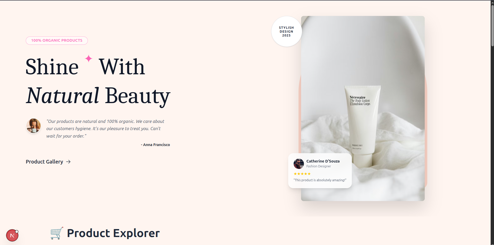
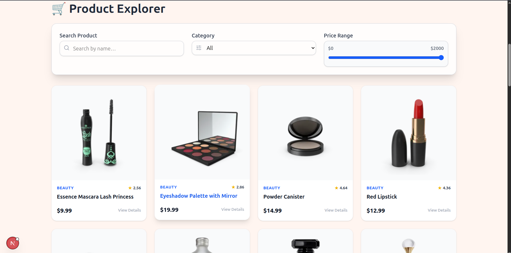
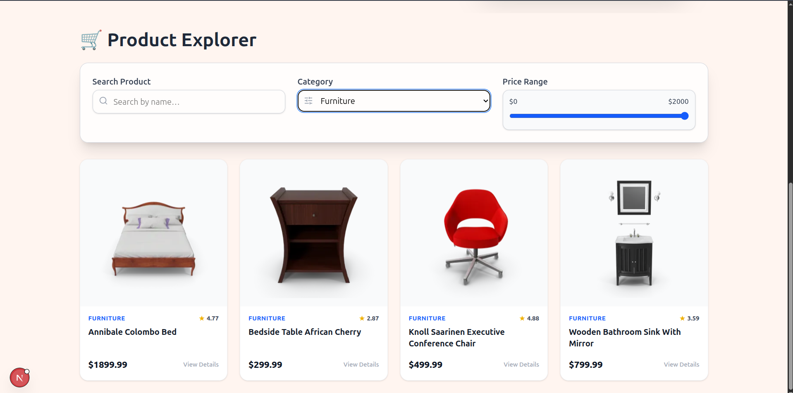
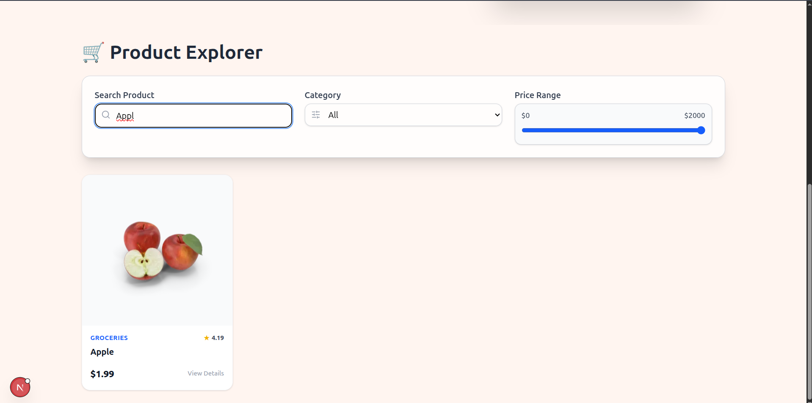

Interactive Product Filtering & Search — Next.js Project

A fully responsive product browsing web application built with Next.js, React, TailwindCSS. The app fetches product data from a public API and allows users to search, filter, and explore items with a smooth UI/UX

screenshot 

Clone the Repository git clone https://github.com/your-username/Filter.git cd image-gallery-slider

Install Dependencies npm install

Run the Development Server npm run dev

Open your browser at:

http://localhost:3000